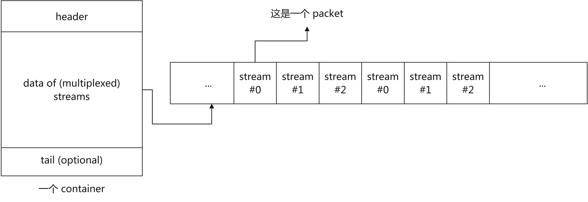
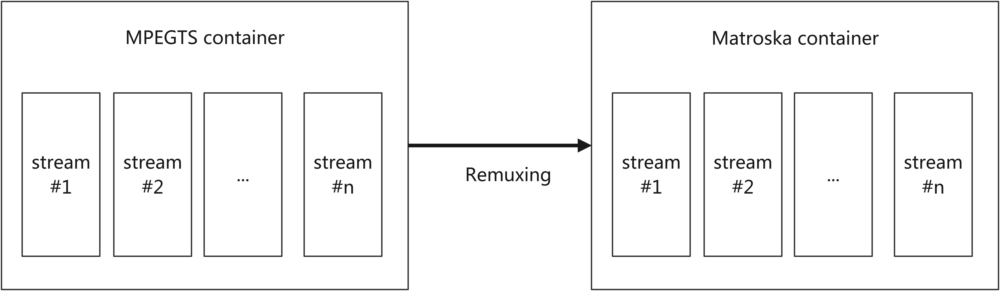
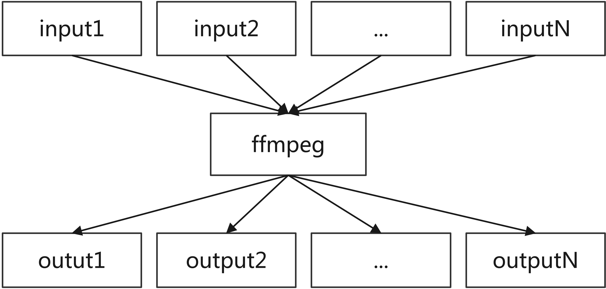

# FFMpeg 的对象模型

## 容器、流、封包和帧

为了应对多种情形下的多媒体处理任务，ffmpeg 代码库针对常见的多媒体数据类型作出了一些抽象。



一个多媒体文件，例如 somemovie.mp4，可以看作是一个 container（容器）。举例：

- “一路向北-周杰伦.mp3” 可以看作是一个 Container；
- “《疯狂动物城》.mkv” 可以看作是一个 Container；
- “花海.png" 可以看作是一个 Container；

容器的作用是容纳多个 streams（流），一个流可以用来存储：

- 一组运动的图片，这样的流也叫做视频流；
- 一段声音（音频流）；
- 一段字幕（字幕流）；
- 任何有可能随着时间变化的数据；

一个流的具象表示是：它是由 packets（封包）组成的，在 ffmpeg 代码库中，一个封包用一个 AVPacket 类型的结构体对象来表示，最基本地，每个 AVPacket 结构体对象至少有它所对应的流的 id（下标索引序号）。

我们说一个流可以看作是一系列的封包，那么来自多个流的封包如何存储到一个容器里边呢？实际上这属于容器格式的范畴，也就是说来自各个流的封包如何放进一个容器中，甚至封包在容器内如何表示和存储，都应该是由容器格式规范来规定的。但是一般来说，为了便于多媒体通过网络播放（也叫“串流”，对应英文单词 streaming），来自多个不同的流的封包一般是在容器中交错排列（如上图所示），假设有 a，b，c 三个流，那么来自这三个流的封包可能会以这样的方式交错 (interleave) 存放：a，b，c，a，b，c，……。



用来自一个或多个流的封包构建一个容器的过程，我们一般称之为 Muxing，从容器中提取（分离）出各个流的过程，叫做 Demuxing，这两个词似乎还没有特别好的翻译。

至此，我们应该已经可以理解，容器和流两者之间是略为「正交」的概念，比如说一个视频流，既可以存放在 movie.mp4 中，也可以存放在 movie.mkv 中，视频流本身是一摸一样的，而变化的只是容器格式。在 ffmpeg 中，有一个简单的命令可以进行这种转换：

```sh
ffmpeg -i movie.mp4 -c copy movie.mkv
```

当然，实际上流和容器并不完全是正交的，并不是任意的所谓”容器“都可以容纳任意类型、任意数量的流。

要对多媒体流进行播放，光从容器中提取出各路流，再从流中切割出一个个的封包还是不够，在 ffmpeg 代码库中，封包就其本身而言只具备关于多媒体信息的最小的知识，换句话说，假设你已拿到一个 AVPacket 结构体对象，你知道它属于哪个流，但是仍然不知道它的具体内容如何，一个封包有可能是来自一个视频流，但是要得到电影的一张图片，可能还需要更多的封包，一个封包也可能来自一个音频流，但是它可能不只包含一个声音波形样本（sample）。

ffmpeg 代码库提供流相应的函数实现从（一个或多个） `AVPacket` 结构体对象得到一个或多个 `AVFrame` 结构体对象，从封包得到帧的这个过程一般称之为「解码」（decoding），反之从帧到封包的这个过程一般称之为「编码」（encoding）。由于原始的像素矩阵需要占用大量的空间来存储、也需要大量的宽带来传输，所以视频（或图像）的编码往往还伴随着压缩，所谓压缩，就是找到一组信息的更加紧凑（更加不占用空间）的表示。压缩分为有损压缩和无损压缩，利用了无损压缩的编码方式也可称为无损编码（lossless encoding），利用来有损压缩的编码方式可称为有损编码（lossy encoding）。

有损压缩为了实现更高的压缩比，会以丢失一部分原始数据中的信息作为牺牲，一个像素阵列经过有损压缩（编码）后再解压缩（解码），则只能得到原始像素阵列的一个近似，一部分原始信息在压缩的过程中被永久的丢弃了。换句话说有损压缩某种程度上是不可逆的（对于被丢失的那部分信息来说）。相比而言，无损压缩是可逆的，理论上，一个像素阵列进行无损压缩，再进行解压缩后仍然能得到和原始数据一摸一样的结果。

在条件允许的前提下（例如在容器格式兼容的情况下），我们应当尽量避免对多媒体数据的重新编码，而是应该尽量地只在封包、流、容器的层面对多媒体数据进行操作。

## ffmpeg 命令行的对象模型

如果说 ffmpeg 代码库处理的基本对象是容器、流、封包和帧，那么则可以说 ffmpeg 命令行工具处理的基本对象是 IO 上下文。程序在工作过程中需要打开文件进行读写，在这过程中有状态信息需要簿记和维护，IO 上下文就是记录这些状态信息的地方。例如一个 IO 上下文可能包括这个文件名，它的 file descriptor，已经读取了多少、已经写入了多少、读取缓冲区、写入缓冲区等。这里所谓的「文件」也不一定是本地磁盘上的文件，在 ffmpeg 命令行参数中，一个文件可以用 URL 来标识，一个文件也可以是一个远程资源，例如 `http://example.com/example.mp4` 这在 ffmpeg 看来也是一个「文件」（或者打开了之后就是 IO 上下文）。

- 当 ffmpeg 打开一个文件是为了从中读取数据，则可以认为相当于创建了一个用于输入的 IO 上下文；
- 当 ffmpeg 打开一个文件是为了写入它，也可以认为此时 ffmpeg 创建了一个 IO 上下文用以簿记和这个文件及文件写入有关的状态；
- 一个 TCP 连接在类 Unix 系统中用一个 socket 建模，socket 也可以看作是文件，ffmpeg 也可以向处理文件那样，处理远程的「文件」（通过 URL 的形式）。

根据上述讨论，我们可以认为「文件」或者「IO 上下文」也是 ffmpeg 命令行所赖以工作的一个重要抽象。

ffmpeg 命令行工具的格式，就其最顶层而言，是这样的一个结构：

```
ffmpeg \
  [maybe global options] \
  -i <input1> -i <input2> ... -i <inputN> \
  <output1> <output2> ... <outputM>
```



我们至少可以看出它支持多个输入（IO 上下文）和多个输出（IO 上下文），其实 N，M 都是正整数，且 N 未必等于 M。

ffmpeg 的命令行参数可分为全局参数，作用在某个流上的参数，作用在某个输入（IO 上下文）上的参数，作用在某个输出（IO 上下文）上的参数。

我们注意到 ffmpeg 命令行参数中每个 `<inputX>` 前面都都有一个 `-i` 参数，事实上如果一个参数它不能被识别为全局参数，或者针对某个输入/输出/流的参数，则它会被认定为是一个 output，换句话说 ffmpeg 会尽力去把每一个参数都挂靠到一个合适的地方，实在做不到的时候，才会把一个参数看作是输出路径。

因此要看明白一条 ffmpeg 命令，首先要知道它有哪些输入、哪些输出、哪些全局参数，然后细看哪些选项是针对哪个输出的，哪些选项是针对哪个输入的，哪些选项是针对具体的流的。

## 一些典型的 ffmpeg 工作模型

这一节中我们来讨论，在一些典型的情形中，用户都用 ffmpeg 命令行工具对什么对象进行什么样的处理。

### Remuxing

在 remuxing 情形中，ffmpeg 打开一个或多个 container 文件，ffmpeg 通过 IO 上下文对象对打开的文件进行控制和状态簿记。然后 ffmpeg 通过 IO 上下文对象从文件头部（或文件名）读取一部分数据，探测 container 是什么格式的：究竟是一个 mp3 格式的 container 还是 mkv 格式的 container 等等，之后，ffmpeg 创建相应的「格式上下文」（AVFormatContext），我们也可以把它理解为「容器上下文」，用来对容器进行控制和簿记针对这个容器进行操作之后所引入的状态。

有了容器上下文，ffmpeg 可以从容器上下文中提取出 packets，每一个 packet 有一个 stream id，这个 stream id 告诉我们这个 packet 来自哪个流，现在只要我们想我们可以把 packets 按照 stream id 进行分门别类的归组，等于说到了这一步，之前以多路复用的方式混合进 container 的 packets，现在已经重新分离出来了。

在这之后，ffmpeg 会打开输出文件，创建相应的格式上下文，然后把刚 demuxed 出来的 packets 写进去。
